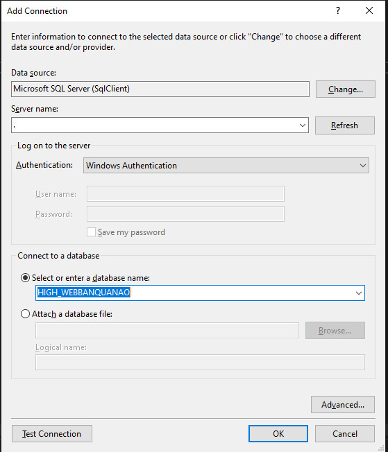
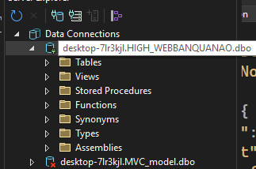
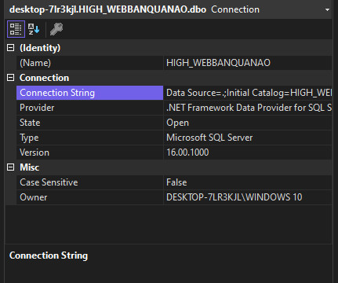
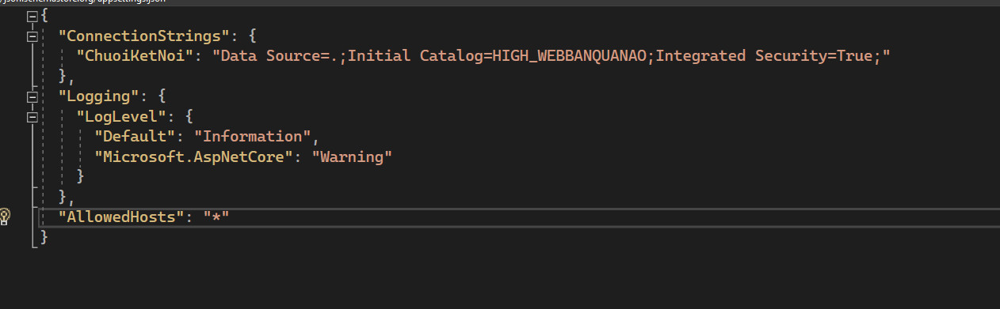

# Hướng dẫn Kết nối Cơ sở dữ liệu SQL Server

Chào mừng bạn đến với trang web bán hàng của chúng tôi! Dưới đây là hướng dẫn chi tiết về cách kết nối cơ sở dữ liệu SQL Server vào ứng dụng của bạn.

## Bước 1: Bấm nút "Ok" để kết nối

Bắt đầu bằng việc bấm nút "Ok" sau khi bạn đã truy cập trang web bán hàng của chúng tôi.

## Bước 2: Kết quả kết nối

Sau khi bấm "Ok," ứng dụng sẽ thực hiện kết nối và hiển thị kết quả như sau:

## Bước 3: Lấy link kết nối

Chuột trái vào kết quả và chọn "Properties" để lấy link kết nối.

## Bước 4: Cập nhật tệp appsettings.json

Thêm phần kết nối cơ sở dữ liệu vào tệp `appsettings.json` của ứng dụng của bạn. Đảm bảo bạn cung cấp đúng thông tin kết nối.

## Bước 5: Chỉnh sửa code trong Program.cs

Trong tệp `Program.cs`, bạn cần chỉnh sửa code để kết nối với SQL Server. Điều này đảm bảo ứng dụng của bạn có thể truy cập và sử dụng cơ sở dữ liệu.

# Danh sách người dùng
